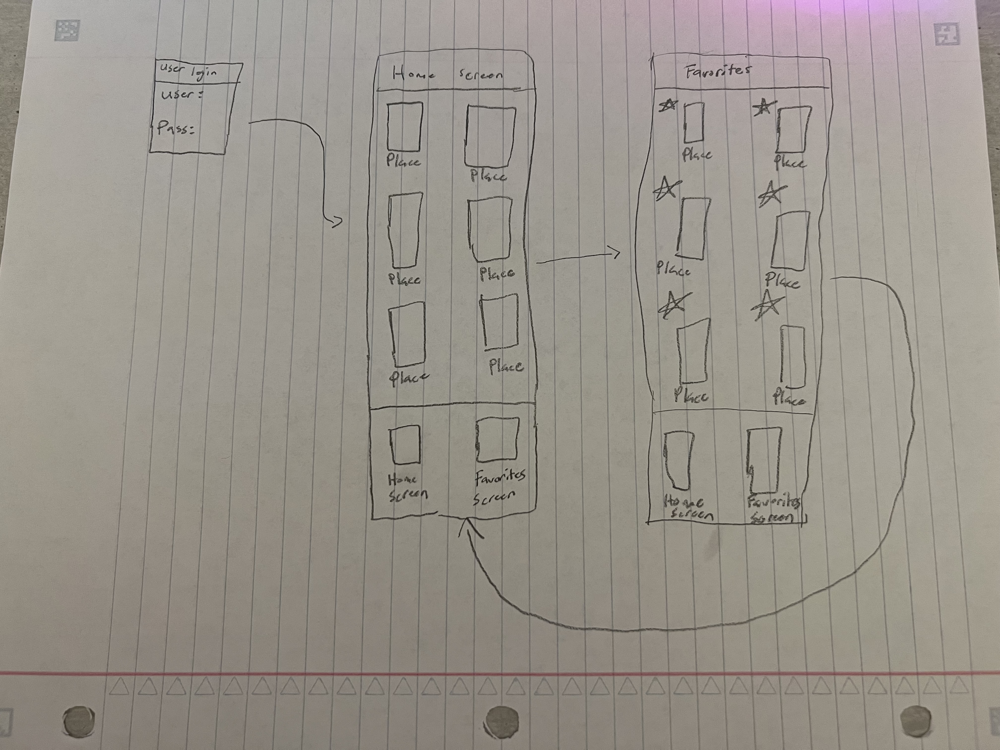
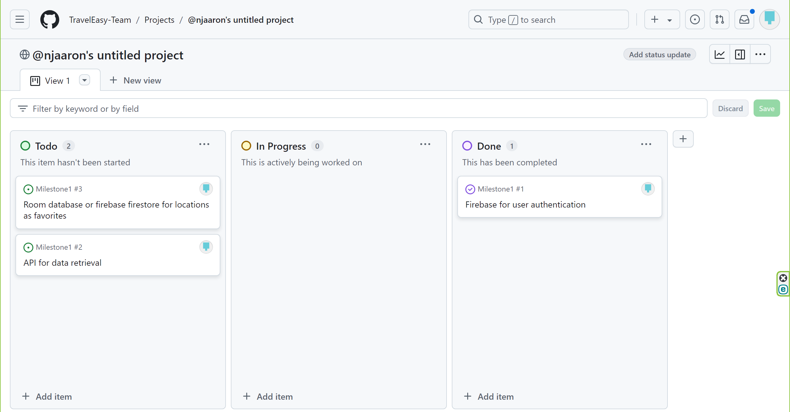
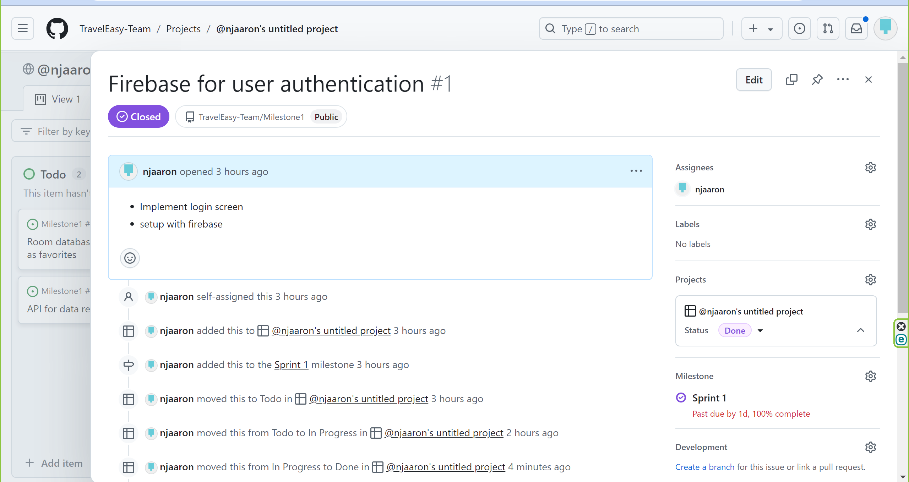
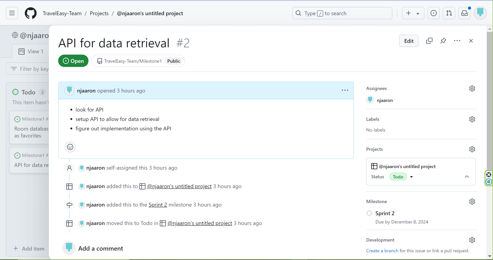
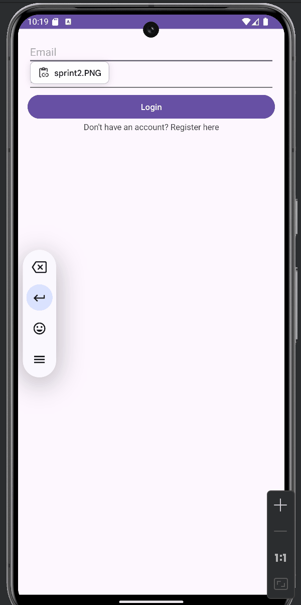

**Milestone 1 - TravelEasy (Unit 7)**

**Table of Contents**
1. Overview
2. Product Spec
3. Wireframes

**Overview**

**Description**
Allows the user to look through certain popular vacation spots. The user can favorite locations if they like them and want to think about going there in the future. The app will also provide certain activities to do within those locations in order to help users plan their itineraries.

**App Evaluation**

- **Category:** Travel

- **Mobile:** Mobile is needed for this because it gives a GPS integration/map for users to be able to find the location and navigate around the area. Can take your location and provide certain ideas on activities you might want to go and try around the area that you are in.

- **Story:** Makes travelling and going on vacation less stressful. People take on a lot of stress when planning for these trips and trying to make it perfect with the activities so having this app will help to make the planning easy yet effective.

- **Market:** Anyone who likes to travel or likes to plan vacations with friends or family.

- **Habit:** Travelers will not use it as often but when they do it will be used a lot throughout the span of a trip or a planning trip process. The average user can both consume and create by looking at popular locations and activities and adding their own as well.

- **Scope:** V1 would allow travelers to see a list of popular location spots to travel to and provide any activities regarding that spot. This could be tested by travelers to see popular spots. V2 would add the mapping of the location. V3 would add the ability to navigate to the location in general. V4 would be user location in order to provide more activities the user can do throughout the day around the area

**Product Spec**

1. **User Features (Required and Optional)**

    **Required Features**

     - Firebase for user auhentication 
     - External API for data retrieval of popular travel locations
     - Room Database or Firebase Firestore to store locations that the user marks as a favorite

    **Optional Features**

     - GPS service to users to help navigate to the location
     - Keeping a consistent UI across everything making it easy for the user to use
     - Have the user be able to share photos of certain locations to help other users who potentially might want to go to that location
2. **Screen Archetypes**
 - Login Screen
     - User can login here
 - Home Screen
     - User can see a list of popular travel spots
 - Saved Screen
     - User can see the locations that they favorited all on one screen
     
3. **Navigation**
**Tab Navigation** (Tab to Screen)

- Home Feed
- Favorites Feed
    
**Flow Navigation** (Screen to Screen)

 - Login Screen
     - =>Home Screen
 - Home Screen
     - =>Saved Screen
 - Saved Screen
     - =>Home Screen
     - 
**Wireframes**

- 

**Milestone 2 - Build Sprint 1 (Unit 8)**

**GitHub Project board**

**Issue cards**

**Issues worked on this sprint**
- Finished the Firebase for user authentication issue. By implementing a login screen, register screen, and a filler home screen that the user can get to after being authenticated through firebase login.

